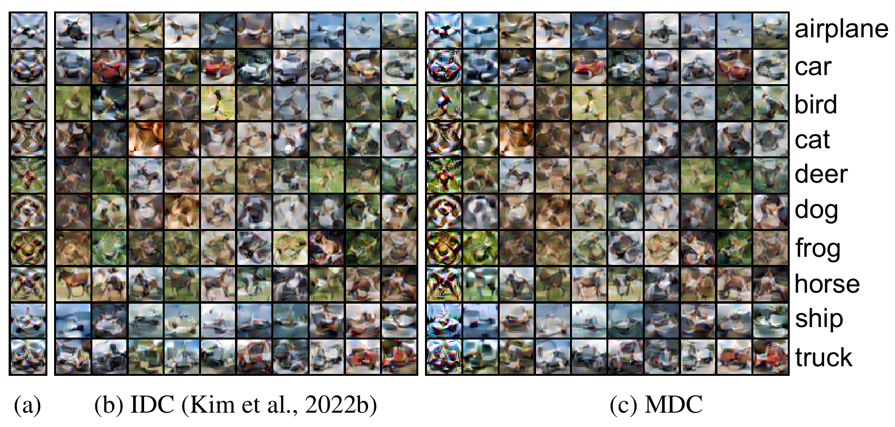

# Multisize Dataset Condensation
[[`Paper`](https://arxiv.org/abs/2403.06075)] | [[`BibTeX`](#citation)]

Official PyTorch implementation of **"[Multisize Dataset Condensation](https://arxiv.org/abs/2403.06075)"**, published at **ICLR'24 (Oral)**




> **Abstract** *While dataset condensation effectively enhances training efficiency, its application in on-device scenarios brings unique challenges. 1) Due to the fluctuating computational resources of these devices, there's a demand for a flexible dataset size that diverges from a predefined size. 2) The limited computational power on devices often prevents additional condensation operations. These two challenges connect to the "subset degradation problem" in traditional dataset condensation: a subset from a larger condensed dataset is often unrepresentative compared to directly condensing the whole dataset to that smaller size. In this paper, we propose Multisize Dataset Condensation (MDC) by **compressing N condensation processes into a single condensation process** to obtain datasets with multiple sizes. Specifically, we introduce an "adaptive subset loss" on top of the basic condensation loss to mitigate the "subset degradation problem". Our MDC method offers several benefits: 1) No additional condensation process is required; 2) reduced storage requirement by reusing condensed images. Experiments validate our findings on networks including ConvNet, ResNet and DenseNet, and datasets including SVHN,  CIFAR-10, CIFAR-100 and ImageNet. For example, we achieved 6.40% average accuracy gains on condensing CIFAR-10 to ten images per class.*

## Code
Key files:
- `condense_reg.py`: main file of the condensation process.
- `reg_ipcx.py`: helper class (class Regularizer) and functions to maintain and update the *most learnable subset (MLS)*.

Key functions (`reg_ipcx.py`):
| Paper Function | Function Name |
| :------------  | :------------ |
| Feature Distance Calculation | [def **feat_loss_for_ipc_reg**():](reg_ipcx.py#L37) |
| Feature Distance Comparison | [def **select_reg_ipc**():](reg_ipcx.py#L113) |
| MLS Freezing Judgement |  [def **get_freeze_ipc**():](reg_ipcx.py#L220) |

## Basic Usage

### Installation

Download repo:
```
git clone https://github.com/he-y/Multisize-Dataset-Condensation MDC
cd MDC
```

Create pytorch environment:
```
conda env create -f environment.yaml
conda activate mdc
```

### Condensing

MDC Condense:
```
python condense_reg.py --reproduce -d [DATASET] -f [FACTOR] --ipc [IPC] --adaptive_reg True

# Example on CIFAR-10, IPC10
python condense_reg.py --reproduce -d cifar10 -f 2 --ipc 10 --adaptive_reg True
```

Parallel running on different classes is also implemented. (See Appendix B.6 to see the accuracy is stable after this parallel running)
```
python condense_reg_mp.py  --reproduce -d [DATASET] -f [FACTOR] --ipc [IPC] --adaptive_reg True --nclass_sub [NUM_SUB_CLASS] --phase [PHASE_ID]

# Example on CIFAR-10, IPC10, two jobs separatly condense class 1-5 and 6-10 
python condense_reg_mp.py --reproduce -d cifar10 -f 2 --ipc 10 --adaptive_reg True --nclass_sub 5 --phase 0 &
python condense_reg_mp.py --reproduce -d cifar10 -f 2 --ipc 10 --adaptive_reg True --nclass_sub 5 --phase 1 &
```

### Testing
To evaluate a condensed dataset, run:
```
python test.py --reproduce -d [DATASET] -f [FACTOR] --ipc [IPC] --test_type [CHOICES] --test_data_dir [PATH_TO_CONDENSED_DATA_DIR] --ipcy [IPCY]

# Example of evaluating the performance of IPC5 from CIFAR-10, IPC10 (repeating 3 times).
python test.py --reproduce -d cifar10 -f 2 --ipc 10 --test_type cx_cy --test_data_dir ./path_to_ipc10_data --ipcy 5 --repeat 3
```

| Test Types | Explaination |
| :------------ | :------------  |
| `other` | (default) evaluate the condensed dataset |
| `cx_cy` | choose IPC[Y] images from total IPC images  |
|         | e.g., choose IPC5 from IPC10 |
| `baseline_b` | concatenate all IPC[1] images to form a IPC[N] dataset |


## Table Results ([Google Drive](https://drive.google.com/drive/folders/1MRHcZla6Kjapgx_UJWIc7wjL8c9CVmN6?usp=drive_link))


The condensed data used in our experiments can be downloaded from [google drive](https://drive.google.com/drive/folders/1MRHcZla6Kjapgx_UJWIc7wjL8c9CVmN6?usp=drive_link), including:

| No.                                                                                                 | Content                                                                                                     | Datasets                                                                                                                                                                                                                                                                                                                                                                                                                 | Methods                                                                                                                                                                                                                                                                              |
| --------------------------------------------------------------------------------------------------- | ----------------------------------------------------------------------------------------------------------- | ------------------------------------------------------------------------------------------------------------------------------------------------------------------------------------------------------------------------------------------------------------------------------------------------------------------------------------------------------------------------------------------------------------------------ | ------------------------------------------------------------------------------------------------------------------------------------------------------------------------------------------------------------------------------------------------------------------------------------ |
| [Table 1](https://drive.google.com/drive/folders/1omKfmanBmXsLPoMGEf4EcRBTDRZdYChX?usp=drive_link)  | Baseline Comparison                                                                                         | [SVHN](https://drive.google.com/drive/folders/12J3usv0GAjHfCW8nmfdvcf9qJCtoa9y8?usp=drive_link)<br>[CIFAR-10](https://drive.google.com/drive/folders/1z4YqMBGn1uHBtv-4xIxH65PqWliTc1Ys?usp=drive_link)<br>[CIFAR-100](https://drive.google.com/drive/folders/1W5DLQSCiq6tO0r7_HwJkEKAB0EB5kgox?usp=drive_link)<br>[ImageNet-10](https://drive.google.com/drive/folders/1Ifi1uy1cjySADiXE_1Jumv-29gWue8fE?usp=drive_link) | Baseline A<br>Baseline B<br>Baseline C<br>MDC                                                                                                                                                                                                                                        |
| [Table 2](https://drive.google.com/drive/folders/1_xUi9a6ERE4k31WDxlByJtKMrhQIV7TX?usp=drive_link)  | SOTA Comparison                                                                                             | [CIFAR-10](https://drive.google.com/drive/folders/1jMCgHNJ7t4deezF3B4J390FO2lyd4is0?usp=drive_link)<br>[CIFAR-100](https://drive.google.com/drive/folders/1IJSRHtNFJQdjtW_IKH9Qf6gTk8qt6S_T?usp=drive_link)                                                                                                                                                                                                                                                                                                     | DC ([ICLR'21](https://arxiv.org/abs/2006.05929))<br>DSA ([ICML'21](https://arxiv.org/abs/2102.08259))<br>MTT ([CVPR'22](https://arxiv.org/abs/2203.11932))<br>IDC ([ICML'22](https://arxiv.org/abs/2205.14959))<br>DREAM ([ICCV'23](https://arxiv.org/abs/2302.14416))<br>MDC (Ours) |
| [Table 3](https://drive.google.com/drive/folders/1kMcojv8h8nqRqyneEhJPVUWiuDzSpqDX?usp=drive_link)  | Ablation study on three components: Calculate, Compare, Freeze                                              | [CIFAR-10](https://drive.google.com/drive/folders/1kMcojv8h8nqRqyneEhJPVUWiuDzSpqDX?usp=drive_link)                                                                                                                                                                                                                                                                                                                      | MDC                                                                                                                                                                                                                                                                                  |
| [Table 4](https://drive.google.com/drive/folders/1QiwkY4sxj2fKVxQ0Rr2V1fBBeDz-LFv_?usp=drive_link)  | Cross Architecture Performance                                                                              | [CIFAR-10](https://drive.google.com/drive/folders/1QiwkY4sxj2fKVxQ0Rr2V1fBBeDz-LFv_?usp=drive_link)                                                                                                                                                                                                                                                                                                                      | Baseline A<br>Baseline B<br>Baseline C<br>MDC<br>(ResNet, DesNet)                                                                                                                                                                                                                    |
| [Table 5](https://drive.google.com/drive/folders/1zbERTetSHeM_9oABMeUDsq3qh4v02IpY?usp=drive_link)  | Evaluation Metric Comparison on three metrics: <br>Gradient Distance, Feature Distance, Accuracy Difference | [CIFAR-10](https://drive.google.com/drive/folders/1zbERTetSHeM_9oABMeUDsq3qh4v02IpY?usp=drive_link)                                                                                                                                                                                                                                                                                                                      | MDC                                                                                                                                                                                                                                                                                  |
| [Table 6](https://drive.google.com/drive/folders/1j7S6Lqpz3WKomHNT0ihqFCyV3IwxOG2i?usp=drive_link)  | Comparisons on intervals: 0, 1, 10, 50, ...                                                                 | [CIFAR-10](https://drive.google.com/drive/folders/1j7S6Lqpz3WKomHNT0ihqFCyV3IwxOG2i?usp=drive_link)                                                                                                                                                                                                                                                                                                                      | MDC                                                                                                                                                                                                                                                                                  |
| **Appendix**                                                                                        |                                                                                                             |                                                                                                                                                                                                                                                                                                                                                                                                                          |                                                                                                                                                                                                                                                                                      |
| Table 7                                                                                             | Feature Distance                                                                                            | (Skipping)                                                                                                                                                                                                                                                                                                                                                                                                               |                                                                                                                                                                                                                                                                                      |
| [Table 8](https://drive.google.com/drive/folders/117JtxBi79nDZhumlmg-3IfTsqlEW1nhD?usp=drive_link)  | MDC on DREAM                                                                                                | [CIFAR-10](https://drive.google.com/drive/folders/117JtxBi79nDZhumlmg-3IfTsqlEW1nhD?usp=drive_link)                                                                                                                                                                                                                                                                                                                      | IDC ([ICML'22](https://arxiv.org/abs/2205.14959))<br>DREAM ([ICCV'23](https://arxiv.org/abs/2302.14416))                                                                                                                                                                             |
| Table 9                                                                                             | Primary Result with Std.                                                                                    | See [Table 1](https://drive.google.com/drive/folders/1omKfmanBmXsLPoMGEf4EcRBTDRZdYChX?usp=drive_link)<br>(logs `xxx.txt`)                                                                                                                                                                                                                                                                                               |                                                                                                                                                                                                                                                                                      |
| [Table 10](https://drive.google.com/drive/folders/18z1vuEkLMzHb5KzU4szMZ7iA3k3nGMaF?usp=drive_link) | Performance during Condensation steps: 0~2000 (with step 100)                                               | [CIFAR-10](https://drive.google.com/drive/folders/18z1vuEkLMzHb5KzU4szMZ7iA3k3nGMaF?usp=drive_link)                                                                                                                                                                                                                                                                                                                      | MDC                                                                                                                                                                                                                                                                                  |
| [Table 11](https://drive.google.com/drive/folders/1SAei7qIWZESZ4yWN-LeETZrAI7hW2a6e?usp=drive_link) | Class-wise MDC                                                                                              | [CIFAR-10](https://drive.google.com/drive/folders/1SAei7qIWZESZ4yWN-LeETZrAI7hW2a6e?usp=drive_link)                                                                                                                                                                                                                                                                                                                      | MDC                                                                                                                                                                                                                                                                                  |

## Related Repos
Our code is mainly developed on following papers and repos:
- Dataset Condensation via Efficient Synthetic-Data Parameterization: [[Paper]](https://arxiv.org/abs/2205.14959), [[Code]](https://github.com/snu-mllab/Efficient-Dataset-Condensation)
- DREAM: Efficient Dataset Distillation by Representative Matching: [[Paper]](https://arxiv.org/abs/2302.14416), [[Code]](https://github.com/lyq312318224/DREAM?tab=readme-ov-file)
- Dataset Condensation with Gradient Matching: [[Paper]](https://openreview.net/pdf?id=mSAKhLYLSsl), [[Code]](https://github.com/VICO-UoE/DatasetCondensation)

## Citation
```
@inproceedings{he2024multisize,
  title={Multisize Dataset Condensation},
  author={He, Yang and Xiao, Lingao and Zhou, Joey Tianyi and Tsang, Ivor},
  booktitle={The Twelfth International Conference on Learning Representations},
  year={2024}
}
```
